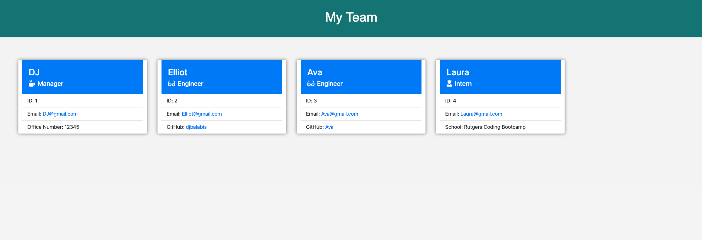

# Team-Profile-Generator

## Description
This Node.js command-line application takes in information about employees on a software engineering team and generates an HTML webpage that displays summaries for each person. Each position includes the name, ID, email as well as office number, GitHub profile or school depending on employees role at the company. The generated HTML webpage has clickable email and GitHub links for each associated team member.

## Built With
* JavaScript
* Node.js
* HTML
* CSS
* Inquirer
* Jest

## Installation
1. Clone the Git repository and run as an integrated terminal.
2. run "npm install"
3. Start the application by running "npm start"
4. Use arrow keys to select roles.

## Usage
Answer prompts in command line (CLI) to generate your teams basic info on an HTML webpage.

## Tests
Testing with Jest are included for each employee type's specific constructor functions and methods.
Run the tests using the command line by typing "npm run test".

## Mock-up

The following images show the web application's appearance and functionality:

## Demonstration
https://photos.app.goo.gl/r3LkNzT7WcCGTanZ8